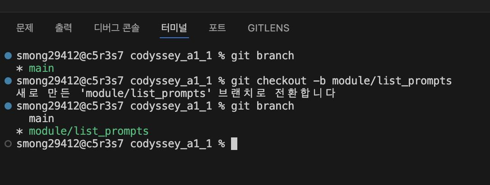
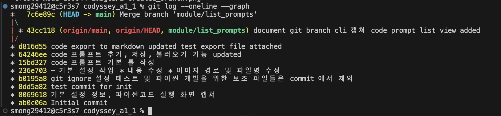

# (A1_1) 컴퓨터에게 명령하는 말(파이썬) 처음 배우고 작업 이력 남기기

## 0. 프로그램 설명 및 실행 방법

# 🚀 CLI 기반 프롬프트 관리 시스템 (Prompt Manager)

## 📖 프로그램 설명

AI 모델(ChatGPT, Claude, Gemini 등)에게 지시할 '프롬프트'를 터미널 환경에서 쉽고 체계적으로 관리할 수 있는 레트로 감성(PC 통신 스타일)의 CLI 콘솔 프로그램입니다.

## 함수 설명

[함수 리스트](./documents/2.function_list.md)

## 🛠️ 실행 방법

1. Python 3.10 이상 환경이 필요합니다. (또는 제공된 Docker 환경 사용)
2. 터미널에서 `src/prompt_ui.py` 파일이 있는 경로로 이동합니다.
3. 아래 명령어를 실행하여 프로그램을 시작합니다.
   ```bash
   python3 prompt_ui.py
   ```

✨ 주요 기능

- 프롬프트 관리 (CRUD): 프롬프트 추가, 목록 조회, 수정, 삭제 기능

- 카테고리 시스템: 카테고리 직접 입력 및 기존 목록 선택 기능, 카테고리별 필터링 기능

- 통합 검색 기능: 제목 및 내용 기반의 키워드 검색 지원

- 즐겨찾기 (Favorite): 자주 쓰는 프롬프트 별도 보관 및 조회 (⭐)

- 조회수 랭킹 시스템: 상세 조회 시 조회수가 증가하며, 조회수 기준 인기 정렬 지원

- 데이터 영속화 (저장/불러오기): data/ 디렉토리에 JSON 형태로 상태 저장 및 로드

- 마크다운 내보내기: export/ 디렉토리에 카테고리별로 깔끔하게 정리된 .md 파일 생성

📂 기본 제공 카테고리

- 프로그램 실행 시 기본적으로 제공되는 카테고리 예시는 다음과 같습니다.

- Image: Midjourney, DALL-E 등을 활용한 이미지 생성용 프롬프트

- Persona: AI에게 특정 직업이나 성격을 부여하는 역할극 프롬프트

- automation: 코드 작성, 크롤러 등 개발 자동화를 지시하는 프롬프트

- (새로운 프롬프트 등록 시 언제든 나만의 카테고리를 자유롭게 추가할 수 있습니다)

---

## 1. 개발환경 셋팅 ([페이지 이동](./documents/1.%20기본-개발환경.md))

- 버전 확인

```
 --version : option

 python3 : 3.13.3
 git : 2.50.1
```

- git config

```
git config --list

* user.name, user.email -> 아래와 같이 입력

git config --global user.name="smong2"
git config --global user.email="smong2@gmail.com"

```

- python3 출력

```
python3 -c 'print("Hello Python!")'
Hello Python!

-c option 으로 파일을 만들지 않고 코드를 즉석으로 실행
```

## 2. git 초기화 및 clone, commit ([페이지 이동](./documents/1.%20기본-git_초기화_연결_커밋.md))

```
    Last login: Wed Jul  1 16:44:58 on ttys000
    smong29412@c5r3s7 ~ % cd Documents
    smong29412@c5r3s7 Documents % cd project

    * directory 생성
    smong29412@c5r3s7 project % mkdir codyssey_a1_1
    smong29412@c5r3s7 project % cd codyssey_a1_1

    * git 초기화 - local name = main
    smong29412@c5r3s7 codyssey_a1_1 % git init -b main
    /Users/smong29412/Documents/project/codyssey_a1_1/.git/ 안의 빈 깃 저장소를 다시 초기화했습니다

    * git remote 설정
    smong29412@c5r3s7 codyssey_a1_1 % git remote add origin https://github.com/smong2/codyssey_a1_1.git

    * 이미 들어가 있는 데이터 가져옴
    smong29412@c5r3s7 codyssey_a1_1 % git pull origin main
    remote: Enumerating objects: 7, done.
    remote: Counting objects: 100% (7/7), done.
    remote: Compressing objects: 100% (6/6), done.
    remote: Total 7 (delta 1), reused 0 (delta 0), pack-reused 0 (from 0)
    오브젝트 묶음 푸는 중: 100% (7/7), 50.58 KiB | 8.43 MiB/s, 완료.
    https://github.com/smong2/codyssey_a1_1 URL에서
    * branch            main       -> FETCH_HEAD
    * [새로운 브랜치]   main       -> origin/main

    * git_init.md 파일 하나 생성
    smong29412@c5r3s7 codyssey_a1_1 % touch git_init.md

    * add, commit 진행, 로그도 inline 으로 작성
    smong29412@c5r3s7 codyssey_a1_1 % git add git_init.md
    smong29412@c5r3s7 codyssey_a1_1 % git commit -m 'test commit for init'
    [main 8dd5a82] test commit for init
    1 file changed, 0 insertions(+), 0 deletions(-)
    create mode 100644 git_init.md

    * git push 실행, 이제 앞으로는 origin 쓰기 귀찮으니 생략
    smong29412@c5r3s7 codyssey_a1_1 % git push -u origin main
    오브젝트 나열하는 중: 4, 완료.
    오브젝트 개수 세는 중: 100% (4/4), 완료.
    Delta compression using up to 6 threads
    오브젝트 압축하는 중: 100% (2/2), 완료.
    오브젝트 쓰는 중: 100% (3/3), 267 bytes | 267.00 KiB/s, 완료.
    Total 3 (delta 1), reused 0 (delta 0), pack-reused 0 (from 0)
    remote: Resolving deltas: 100% (1/1), completed with 1 local object.
    To https://github.com/smong2/codyssey_a1_1.git
    8069618..8dd5a82  main -> main
    branch 'main' set up to track 'origin/main'.
    smong29412@c5r3s7 codyssey_a1_1 %
```

---

## .gitignore 처리

```
smong29412@c5r3s7 codyssey_a1_1 % touch .gitignore
smong29412@c5r3s7 codyssey_a1_1 % vi .gitignore

* .gitignore 에 아래 내용 추가

# just for test
.test_codyssey


* 파일 상단에 들어간 내용 확인 (head command 사용)
smong29412@c5r3s7 codyssey_a1_1 % head -n 2 .gitignore
# just for test
.test_codyssey


* .test_codyssey 파일 생성

smong29412@c5r3s7 codyssey_a1_1 % touch .test_codyssey


* git status 확인

smong29412@c5r3s7 codyssey_a1_1 % git status
현재 브랜치 main
브랜치가 'origin/main'에 맞게 업데이트된 상태입니다.

커밋하도록 정하지 않은 변경 사항:
  (무엇을 커밋할지 바꾸려면 "git add/rm <파일>..."을 사용하십시오)
  (use "git restore <file>..." to discard changes in working directory)
	수정함:        .gitignore
	삭제함:        a1-1_basic_check.png

추적하지 않는 파일:
  (커밋할 사항에 포함하려면 "git add <파일>..."을 사용하십시오)
	documents/
	images/

커밋할 변경 사항을 추가하지 않았습니다 ("git add" 및/또는 "git commit -a"를
사용하십시오)

* directory 내 파일 리스트 ( .test_codyssey 파일 존재하지만 추적되지는 않음)

smong29412@c5r3s7 codyssey_a1_1 % ll -a
total 24
drwxr-xr-x   9 smong29412  smong29412   288  7  1 17:34 .
drwxr-xr-x   3 smong29412  smong29412    96  7  1 17:17 ..
drwxr-xr-x  14 smong29412  smong29412   448  7  1 17:35 .git
-rw-r--r--   1 smong29412  smong29412  4660  7  1 17:31 .gitignore
-rw-r--r--   1 smong29412  smong29412     0  7  1 17:34 .test_codyssey
drwxr-xr-x   4 smong29412  smong29412   128  7  1 17:21 documents
-rw-r--r--   1 smong29412  smong29412     0  7  1 17:18 git_init.md
drwxr-xr-x   5 smong29412  smong29412   160  7  1 17:36 images
-rw-r--r--   1 smong29412  smong29412    30  7  1 17:17 README.md
smong29412@c5r3s7 codyssey_a1_1 %
```

---

## merge

### make branch

- git branch 로 현재 존재하는 branch 확인 후
- module/list_prompts branch 를 생성한 후 checkout 

### merge

- merge 현황을 그래프로 확인할 수 있음 
