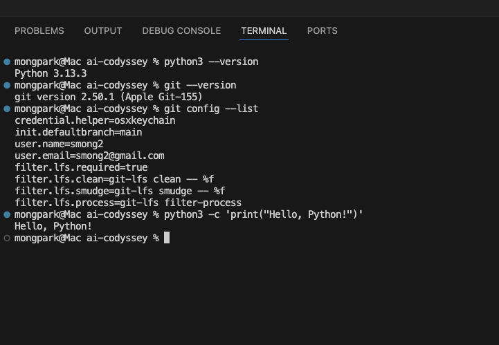
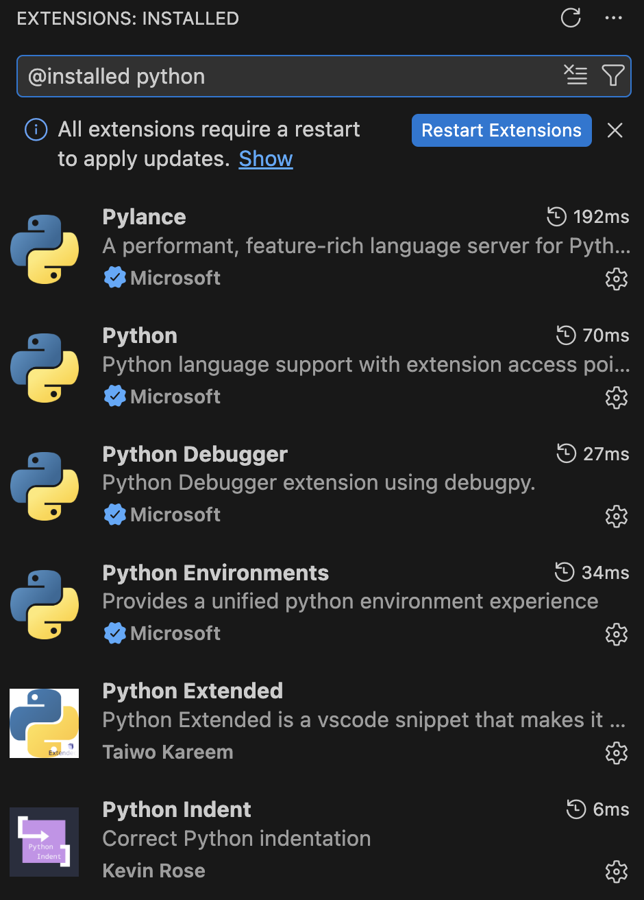
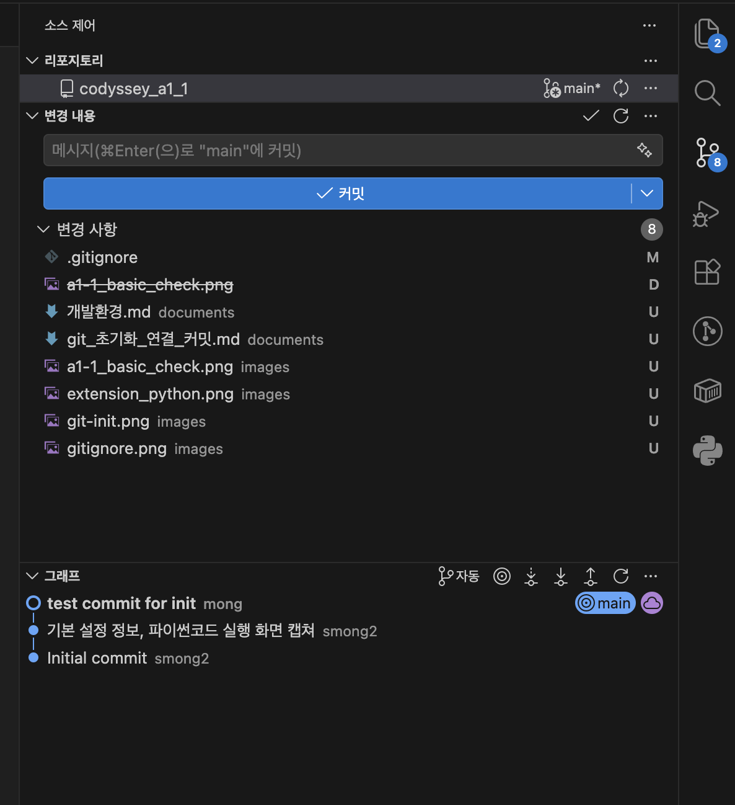

## 개발환경 - terminal 버전


---

* 버전 확인
```
 --version : option

 python3 : 3.13.3
 git : 2.50.1
 ```

* git config 
```
git config --list

* user.name, user.email -> 아래와 같이 입력

git config --global user.name="smong2"
git config --global user.email="smong2@gmail.com" 

```

* python3 출력

```
python3 -c 'print("Hello Python!")'
Hello Python!

-c option 으로 파일을 만들지 않고 코드를 즉석으로 실행
```


## 개발환경 - VSCode

* 파이썬 확장설치



* vscode 에서 github 연동 (main 브랜치 기본 설정 확인됨)
 